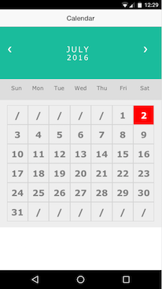

#Calendar View
This software is an ionic directive that implements a Calendar. The css is inspired to W3C example, you can get more information [here ](http://www.w3schools.com/howto/howto_css_calendar.asp). 

##Usage
* Clone this repo
* Copy following files to your project ( these files are in www/calendar-view-directive directory)
	* calendar-view.css
	* calendar-view.html
	* calendar-view.js
* Import the directive to your project, the name of the directive is "directive.calendarView"
* Use the below istruction to add the calendar to your html `<calendar-view callback="eventDateSelected" ></calendar-view>`
* Define the callback in your controller to manage the selected date. 

`$scope.eventDateSelected = function(newdate) {` 

`// manage new date here`

`alert(newdate);`
`}`

##Snapshot

